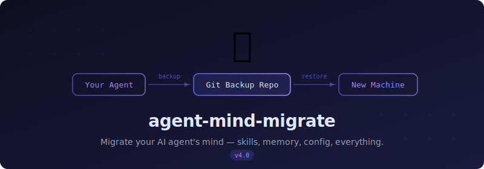
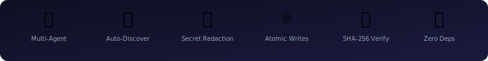

<div align="center">



<br>

**You spent weeks teaching your AI agent.<br>Don't lose it to a machine swap.**

One command to backup. One command to restore.

[](https://www.python.org/downloads/)
[](LICENSE)
[]()
[]()

`Atomic Writes` · `SHA-256 Integrity` · `Auto Secret Redaction` · `Smart Merge`

[English](#quickstart) · [中文](#中文)

</div>

---

## Quickstart

**You need:** Python 3.8+ · Git · A [private GitHub repo](https://github.com/new)

```bash
# Install
git clone https://github.com/AlphaWill0/agent-mind-migrate.git ~/.claude/skills/agent-mind-migrate

# Setup (once)
python3 ~/.claude/skills/agent-mind-migrate/scripts/migrate.py init --remote <your-repo-url>

# Backup
python3 ~/.claude/skills/agent-mind-migrate/scripts/migrate.py backup --push
```

Or just tell Claude Code: **"back up my config"** — it figures out the rest.

<details>
<summary>💡 Create a short alias</summary>

```bash
alias migrate='python3 ~/.claude/skills/agent-mind-migrate/scripts/migrate.py'
# Then just: migrate backup --push
```

</details>

---

## New Machine

```bash
git clone <your-backup-repo-url> ~/.claude-backup
git clone https://github.com/AlphaWill0/agent-mind-migrate.git ~/.claude/skills/agent-mind-migrate
python3 ~/.claude/skills/agent-mind-migrate/scripts/migrate.py restore --dry-run    # preview
python3 ~/.claude/skills/agent-mind-migrate/scripts/migrate.py restore              # restore
```

That's it. Your agent remembers everything.

> Run `validate` after restore — fill in any `__REDACTED__` placeholders with your real API keys.

---

## What It Captures

Auto-detects installed agents. Zero configuration.

| | Claude Code | OpenClaw | Hermes |
|---|:---:|:---:|:---:|
| Config & settings | ✅ | ✅ | ✅ |
| Memory | ✅ | ✅ (SQLite) | ✅ |
| Skills | ✅ | — | ✅ |
| Rules & agents | ✅ | — | ✅ (SOUL.md) |
| Commands & cron | ✅ | ✅ | ✅ |
| Project memories | ✅ | — | — |
| Extensions / plugins | ✅ | ✅ | — |

Git-based skills store URL + commit SHA only — auto-cloned on restore.

---

## Security

**Your secrets never touch Git.** API keys, tokens, and passwords are replaced with `__REDACTED__` before every commit — including MCP server configs and skill remote URLs. On restore, placeholders smart-merge with your machine's real values. Credentials directories are excluded entirely.

---

## Roadmap

- [ ] `init` auto-creates the backup repo via `gh`
- [ ] Scheduled auto-backup
- [ ] Diff view: what changed since last backup

If any of these matter to you, a ⭐ helps me prioritize.

**Found a bug?** [Open an issue](https://github.com/AlphaWill0/agent-mind-migrate/issues) · **Built another agent?** The [plugin architecture](#-add-your-own-agent) makes it easy to add support. PRs welcome.

---

<details>
<summary><b>Advanced Usage</b></summary>

### Commands

```
migrate.py init --remote <url>           # First-time setup
migrate.py backup [--push]               # Backup all detected agents
migrate.py backup --tier full --push     # Full backup (history + plugins)
migrate.py backup --agents claude-code   # Specific agent only
migrate.py restore --dry-run             # Preview (always do this first)
migrate.py restore --only skills memory  # Selective restore
migrate.py restore --agents openclaw     # Specific agent only
migrate.py status                        # Backup status
migrate.py validate                      # Health check
```

### Tiers

| Tier | Includes | Use case |
|------|----------|----------|
| `essential` (default) | Config, memory, skills, rules, commands, cron, stats | Daily backup |
| `full` | + command history, plans, plugins | Machine migration |

### Restore Flags

| Flag | Effect |
|------|--------|
| `--conflict backup-existing` | Default — back up existing files before overwriting |
| `--conflict overwrite` | Overwrite directly |
| `--conflict skip` | Skip existing files |
| `--only <modules>` | `config` `memory` `skills` `rules` `agents` `commands` `scheduled_tasks` `stats` `project_memories` `plans` `history` `plugins` |
| `--agents <name>` | Specific agent only |
| `--dry-run` | Preview without changes |
| `--yes` | Skip confirmation prompt |
| `--no-pull` | Skip auto-pull from remote |

Project memories with absolute paths are auto-translated to the new machine's HOME during restore.

</details>

<details>
<summary><b>Add Your Own Agent</b></summary>

```python
class YourAgentPlugin(AgentPlugin):
    name = "your-agent"
    config_dir = Path.home() / ".your-agent"

    def discover(self) -> bool: ...
    def backup(self, staging, tier) -> list: ...
    def restore(self, source, conflict, only) -> None: ...
    def sanitize(self, data) -> tuple: ...
    def status(self, repo) -> dict: ...
```

Register in `AGENT_PLUGINS`. Auto-discovered.

</details>

<details>
<summary><b>FAQ</b></summary>

**Why not `cp -r ~/.claude`?**
> Copies API keys into git. No integrity checks, no redaction, no selective restore.

**Why not chezmoi / yadm?**
> Built for shell config. AI agent state is different — SQLite, nested git repos, scattered project memory. This tool understands the structure.

**Only use Claude Code?**
> It auto-detects. One agent installed → one agent backed up.

**Is it safe?**
> Secrets redacted before commit. SHA-256 per file. Atomic writes. Smart merge on restore.

</details>

<details>
<summary><b>Changelog</b></summary>

### v4.1
- Bilingual CLI (auto-detects zh/en)
- MCP config sanitization, git URL credential stripping, Hermes config.yaml redaction
- Restore confirmation prompt, auto git pull, default conflict → `backup-existing`
- Cross-machine path translation for project memories
- Symlink detection fix, validate exit code fix

### v4.0
- Multi-agent: Claude Code + OpenClaw + Hermes
- Per-agent directories, `--agents` flag, AgentPlugin architecture

### v3.x
- Atomic writes, SHA-256, smart merge, cross-platform, selective restore

</details>

---

<div align="center">

## 中文

</div>

**一条命令备份，一条命令还原。换机器不丢记忆。**

### 备份

```bash
git clone https://github.com/AlphaWill0/agent-mind-migrate.git ~/.claude/skills/agent-mind-migrate
python3 ~/.claude/skills/agent-mind-migrate/scripts/migrate.py init --remote <备份仓库URL>
python3 ~/.claude/skills/agent-mind-migrate/scripts/migrate.py backup --push
```

或对 Claude Code 说「**备份一下**」。

### 新机器还原

```bash
git clone <备份仓库URL> ~/.claude-backup
git clone https://github.com/AlphaWill0/agent-mind-migrate.git ~/.claude/skills/agent-mind-migrate
python3 ~/.claude/skills/agent-mind-migrate/scripts/migrate.py restore --dry-run
python3 ~/.claude/skills/agent-mind-migrate/scripts/migrate.py restore
```

> 还原后 `validate`，把 `__REDACTED__` 替换为真实密钥。

### 支持的 Agent

自动检测，零配置。

| Agent | 备份内容 |
|-------|---------|
| **Claude Code** | 配置、记忆、技能、规则、命令、定时任务、项目记忆 |
| **OpenClaw** | 配置、bot 设置、记忆、定时任务、插件 |
| **Hermes** | 配置、身份、记忆、技能、定时任务 |

**安全**：token / 密码 / API key 自动脱敏，不进 git。还原时保留本机真实值。

---

<div align="center">



<br><br>

**Your agent's mind deserves a backup plan.**

MIT License · [AlphaWill](https://github.com/AlphaWill0)

</div>
